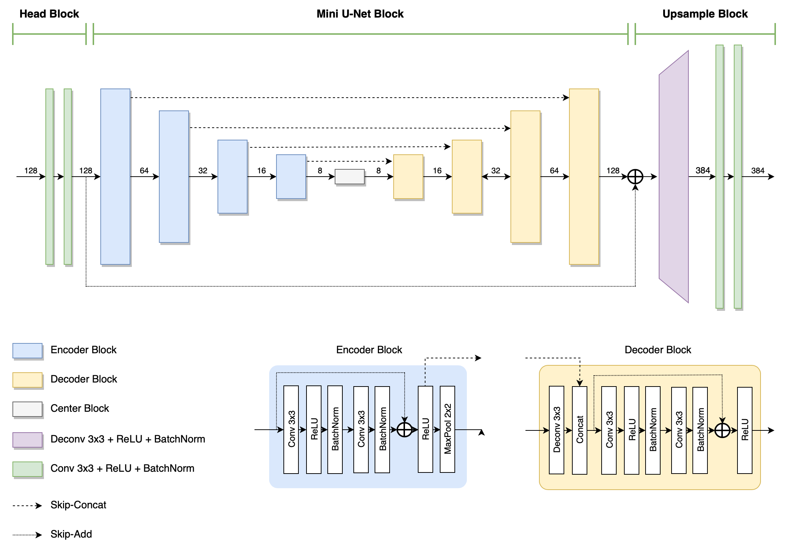
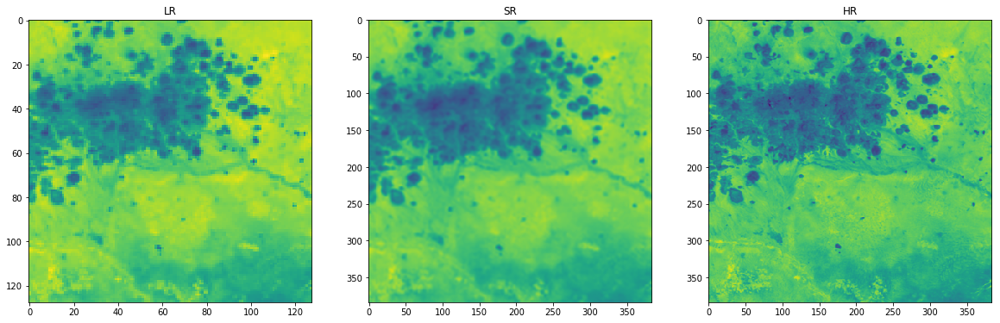
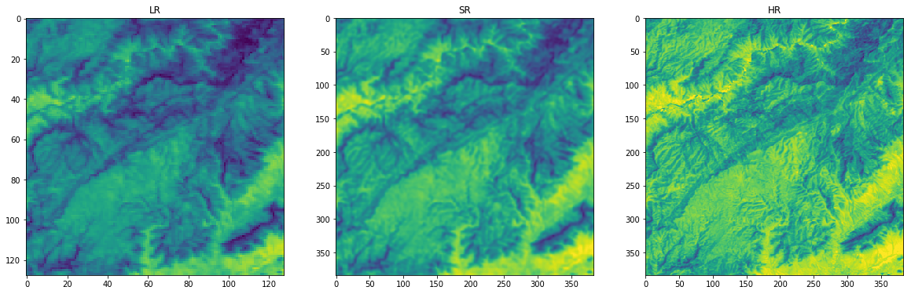
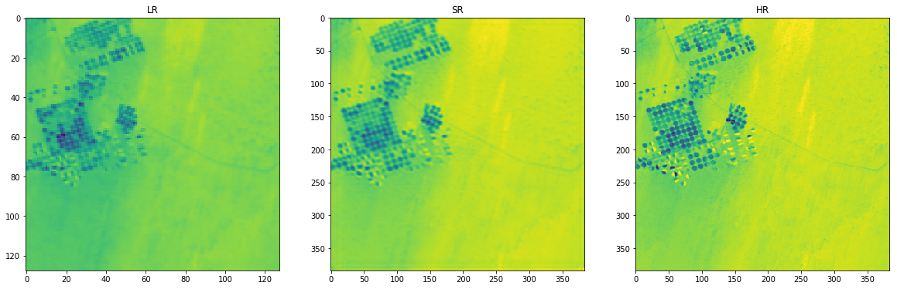
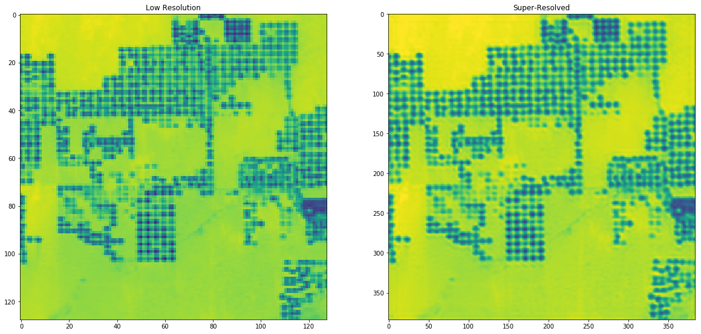
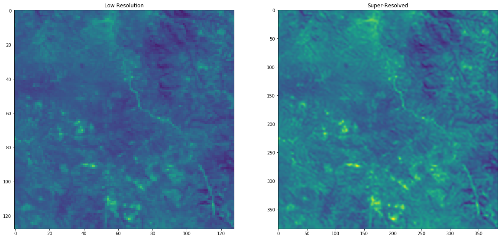

# PROBA-V Super-Resolution
## About
This is my quick attempt at the PROBA-V Super Resolution Competition. Competition website: https://kelvins.esa.int/proba-v-super-resolution/.

<a href="https://kelvins.esa.int/proba-v-super-resolution/">
</a>

> “In this competition you are given multiple images of each of 74 Earth locations and you are asked to develop an algorithm to fuse them together into a single one. The result will be a "super-resolved" image that is checked against a high resolution image taken from the same satellite, [PROBA-V](https://en.wikipedia.org/wiki/PROBA-V).”

## Custom Architecture

I developed a custom deep learning architecture specifically for this task. See report for details.

## Usage
### Pre-Trained Model & Results
`Notebook.ipynb` is the main file containing training and results.

`Report.pdf` is the project report describing problem analysis, approach and results.

`model.h5` is the fully trained model.

`submission.zip` contains the results for submission (inference on the test set).

### Train on Local Machine
1. Make sure you have [conda](https://www.anaconda.com) installed
2. Clone this repo
```
git clone https://www.github.com/rizandigp/PROBA-V-Super-Resolution
cd PROBA-V-Super-Resolution
```
3. Download the data
```
wget -P probav_data https://kelvins.esa.int/media/competitions/proba-v-super-resolution/probav_data.zip
unzip -q probav_data/probav_data.zip -d probav_data
```
4. Prepare environment
```
# Set up conda environment
conda env create -f environment.yml
conda activate probav

# Get dependencies
pip install git+https://www.github.com/keras-team/keras-contrib
git clone https://github.com/lfsimoes/probav
git clone https://github.com/rizandigp/keras_superconvergence
```
5. Run `Notebook.ipynb`

### Train on Google Colab
1. Upload `Notebook_Colab.ipynb`, `dataset.py`, `model.py` and `training.py` to Colab
2. Run the notebook

## Results
### Results on Validation Set




### Results on Test Set

